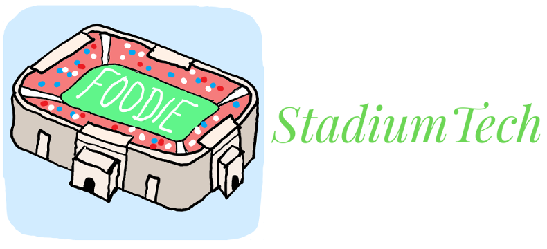

FOODIE
=======

__FOODIE__ is the flagship product of StadiumTech! FOODIE offers a quick and easy way for you to receive in-the-stands delivery, in _any_ sports stadium throughout the United States! Order from your mobile phone and never miss the highlights again!

Who made this?
--------------

StadiumTech, an in-house company that offers technology to make your sports experience better! Our motto: _"Never miss a pitch!"_

No, _who_ really made this?
---------------

The founding fathers of our company are as follows:

* __Kaitlyn DeValk__ - Coordinator
* __John Hammond__ - Software Developer
* __Chris Rosselot__ - Hardware Developer
* __Hayden Carter__ - Research & Development
* __Edmund Huminski__ - Art & Design

Why did you make this?
-------------------

Say that you are seated at the big game. Say you finally got the kids out of the car, say you finally got your spouse to find the seats, and all you want to do is sit, relax, and enjoy the game. 

But... you hear your stomach growling. You're hungry. Shoot, the game is just getting started!

Here is where FOODIE comes in.

You take out your cellphone, browse the food options available your stadium, and order right from the comfort of your seat. Within minutes, your meal is brought to you and you never missed any of the action!

We as a team saw there was a ___problem___ with the sports fan experience and venue. Our product is a viable ___solution___!

Hasn't this already been done before?
---------

This idea has been _tested_ but never got off the ground. __Seat Serve__, a 2015 company attempted this idea but only in one stadium, and only in one section of seating. They charged the Internet but never passed a thousand downloads, targeting only soccer in Amsterdam.

This effort proves to us that it is a marketable idea, but it needs to be done with usability and in a scalable fashion.  

Disclaimer
-----------

_This page and all content is only developed for a Hackathon competition at the University of Connecticut; it is by no means a legitimate company or product._

-----------------

Verbose Report
---------------

The experience of a live sporting event just isn’t the same anymore. Long lines for food, bathrooms, and ticketing can turn an otherwise enjoyable day into a frustrating and tedious experience. That’s why Stadium Tech is here to help! Our goal is to make your live game experience just as convenient as sitting at home while watching the game. Our current prototype  FOODIE is the first in a line of products that we hope will improve your fan experience at a stadium venue near you! FOODIE addresses the problem of long lines with the use of a food delivery system right to your seat! Using our web application to place an order at the concessions available in your stadium, Stadium Tech servers stationed at each of the concessions will get the order started for you and deliver it in a timely fashion. Our use of a server and customer login allows the customer a separate interface for ordering and paying on the customer end while the server can update the progress of an order all the way up to deliver.

Some of the complexities that our app does address is someone ordering food while not in their seat, which would confuse a server if they delivered food to an empty seat. Our solution to this is implementing a PIR with Arduino to read in the distance that someone is from their seat. If the distance is more than 12 inches, the user will be alerted that they cannot place an order due to not being in their seat. This allows a user to order food and then go to the bathroom while they are waiting for their order to be processed and delivered. Another complication that will need to addressed stadium by stadium is WiFi capabilities of that particular venue. FOODIE is meant to make the fan experience more enjoyable and increase sales for the venues, so making sure capability is at its fullest is key for this application to be of use.

Our prototype integrates ideal functionality through open-source technology, but does not necessarily implement proper security practices yet. This is the stage for proof of concept and rapid prototype development, modeling the interaction for a user and server with our application. Our application will be cross-platform due to it not specifically being a mobile app on your phone but rather a web application accessible from anywhere no matter Android or iOS. Currently, there is only one other application that we have found to be similar to our idea. It is called ‘SeatServe,’ was built specifically through mobile application use, and was geared towards premium seating only in a specific stadium. This business has not expanded past two European soccer stadiums, one each in Amsterdam and Ireland, in the past 3 years. Over the past two years ‘GrubHub’ has also done research and development into the possibility of this idea, but no progress or tangible development has come out of that. Our idea is innovative past ‘SeatServe’ in that our goal is to target the fans that can’t afford premium seating in the club or presidential boxes at stadiums. Those seats already have in-service food delivery, so ‘SeatServe’ is simply contracting that out for the stadium. Our application is designed to help the small family that is taking their kids to their first baseball game or maybe those diehard fans that never want to miss a minute of the action.

We think that these other companies and previous applications that attempted this similar products are validation for the market that we are trying to enter. Furthermore, we are targeting a larger customer base versus premium seating. Our target is also not fans or users themselves but rather a stadium implementing our service, so we are not relying on downloads through an App Store to launch our application or business. We also implement an integrity-checker for stadiums to see if people are sitting in their seat while attempting to order. This allows for ease of delivery for the servers as well data analytics for the stadium to see what seats are filled. This benefits Stadium Tech in not wasting food or a server’s time and the stadium itself through data in which concessions are most popular as well as which areas of the stadium fills seating more than other areas.
